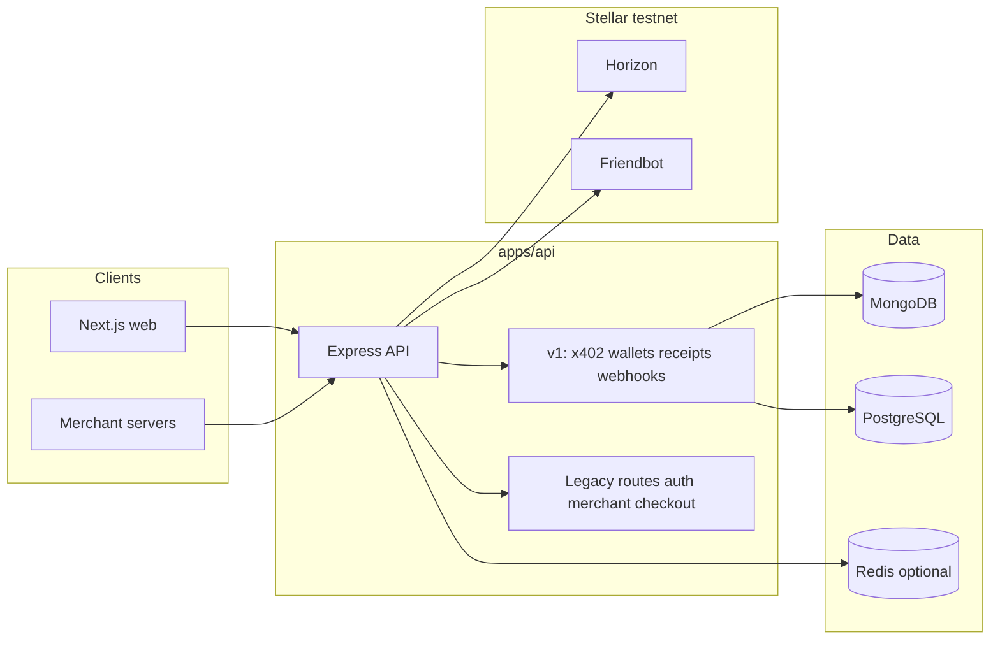

# PayKit

PayKit is a payments and developer platform for **Stellar** with an **x402**-oriented HTTP API: verify payment headers, settle into **receipts**, notify **webhooks**, and manage **merchant-scoped agent wallets** (custodial Stellar keys with policy hooks). The repo is a **pnpm monorepo**.

## Architecture



| Package / app | Role |
|---------------|------|
| **`apps/api`** | Express server: **`/v1/*`** (x402, agent wallets, receipts, webhooks), **`/events/stream`** (SSE), Google OAuth, merchant checkout, Mongo + Prisma/Postgres + optional Redis. |
| **`apps/web`** | Next.js (App Router): marketing **`/`**, **`/demo`**, **`/docs`**, **`/playground`**, merchant **`/dashboard`**, checkout UI. |
| **`packages/*`** | SDK-facing libraries published as **`@h4rsharma/paykit-sdk`** (aggregator) and **`@h4rsharma/paykit-*`** (see `packages/`). |
| **`contracts/spending-policy`** | Soroban spending-policy / smart-account plugin (Rust). |

**Default network:** Stellar **testnet** (Horizon + Friendbot). See `apps/api/.env.example` for issuers and URLs.

## Quick start

```bash
pnpm install
pnpm run build
```

- API: `cd apps/api && pnpm run dev` — see `apps/api/README.md` and `apps/api/.env.example`.
- Web: `cd apps/web && pnpm run dev` — see `apps/web/.env.example` for `NEXT_PUBLIC_PAYKIT_API_URL`.

End-to-end API smoke test (needs a real merchant API key and DBs):

```bash
export E2E_API_KEY=pk_...
pnpm test:e2e:api
```

## Docs in repo

- **`MIGRATION.md`** — phased migration plan (phases 1–6) and schema notes.
- **`DEMO_SCRIPT.md`** — step-by-step local demo and Playground usage.

## Scripts (root)

| Script | Description |
|--------|-------------|
| `pnpm run build` | Build all workspace packages that define `build`. |
| `pnpm run test:e2e:api` | Run HTTP happy-path against a running API (`E2E_API_KEY`, optional `E2E_BASE_URL`). |
| `pnpm changeset` / `pnpm version-packages` / `pnpm publish-packages` | Changesets for publishable SDK packages. |

## License

See package manifests; default project licensing follows repository policy set by the maintainers.
